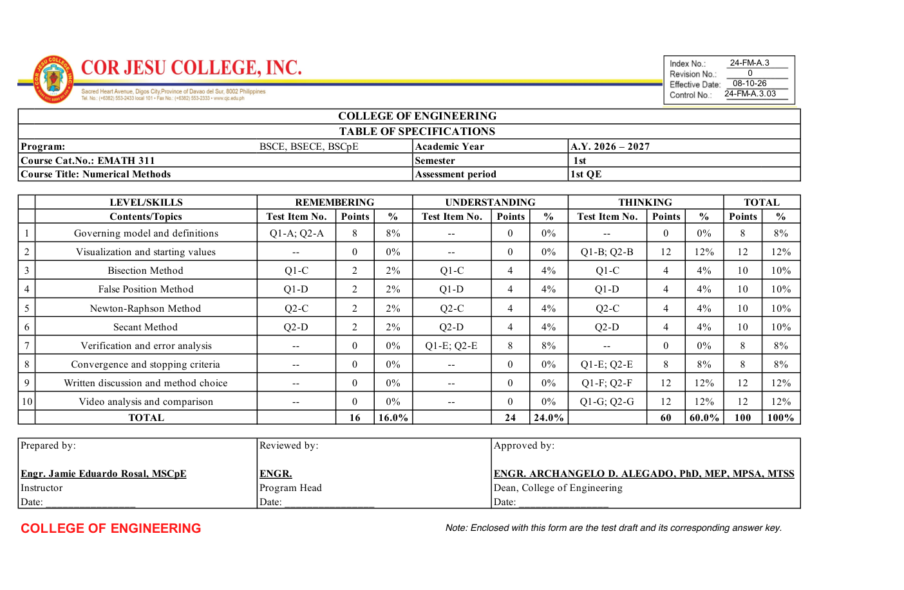

# CoE-TOS

**Draft a College of Engineering Table of Specifications from supplied documents,
preserve the Excel form, and deliver a filled XLSX, matching PDF and scoring review.**

By **Engr. Jamie Eduardo Rosal, MSCpE**.

CoE-TOS is an [Agent Skills](https://agentskills.io/specification) package with
portable instructions and deterministic Python tools. It has no model/provider
API dependency. Use it with GPT-based agents, Claude, Gemini, local instruction
models or another LLM through a suitable harness. The model analyzes the material;
the scripts extract documents, reconcile scores and generate the artifacts.

## What it does

- Reads exams, rubrics, syllabi, learning outcomes and teaching materials together.
- Maps an **existing examination** or drafts a **proposed assessment blueprint**.
- Records evidence locators and cognitive classification rationales.
- Reconciles question, criterion, **published subcriterion**, topic and cognitive totals.
- Fills the bundled Cor Jesu College (CJC) form or another mapped XLSX template.
- Preserves the original banner, grouped drawings, logos, formulas, styles,
  validations, protection and package relationships.
- Exports PDF through Microsoft Excel on macOS or LibreOffice.
- Reports missing information, band conflicts, extraction gaps and unfinished review.

It does **not** infer a valid cognitive allocation by forcing numbers into
institutional bands. An explicit recall task can receive remembering marks;
using remembered knowledge during application is not independently scored recall.



*Example output from the proposed assessment in this repository. Institutional
approval and educational classification remain separate from arithmetic checks.*

## Quick start

### 1. Download

Clone this repository or download its ZIP through GitHub's **Code → Download ZIP**:

```sh
git clone https://github.com/Baboyeatami/coe-tos.git
```

Open a terminal in the downloaded `coe-tos` directory. All commands below run
from there unless an installation path is explicitly shown.

### 2. Install the skill in your agent

| Harness | User install command | Location |
|:--|:--|:--|
| OpenCode | `python scripts/install.py --harness opencode` | `~/.config/opencode/skills/coe-tos` |
| Codex | `python scripts/install.py --harness codex` | `~/.agents/skills/coe-tos` |
| Claude Code | `python scripts/install.py --harness claude` | `~/.claude/skills/coe-tos` |
| Other hosts | `python scripts/install.py --harness generic --destination /path/to/skills/coe-tos` | Your chosen location |

Project-scoped installation:

```sh
python scripts/install.py --harness opencode --scope project --project /path/to/project
```

Project folders are `.opencode/skills/coe-tos`, `.agents/skills/coe-tos`, or
`.claude/skills/coe-tos` for the corresponding host. The installer refuses to
overwrite existing installations; use `--force` only after inspecting them.

**Restart OpenCode** to load the new skill. Codex discovers skills automatically;
restart if it is missing. Reload/restart Claude Code if the command is missing.

For an [installable release ZIP](https://github.com/Baboyeatami/coe-tos/releases), extract the entire **`coe-tos/`** folder into your
host's skill directory. Do not copy just `SKILL.md`; retain scripts, assets and
references. You can also ask a skill-aware installer to install
`skills/coe-tos` from this GitHub repository.

### 3. Install tool dependencies

Python **3.10 or later**:

```sh
python -m venv .venv
```

Activate the environment:

```sh
# macOS / Linux
source .venv/bin/activate
```

```powershell
# Windows PowerShell
.venv\Scripts\Activate.ps1
```

Then install:

```sh
python -m pip install -r skills/coe-tos/scripts/requirements.txt
```

For a copied installation, use its actual requirements path instead. Tell your
agent to use this environment's Python interpreter. On some systems the command
is `python3` (Unix) or `py` (Windows).

**PDF export:** install Microsoft Excel on macOS, or LibreOffice on Windows,
macOS or Linux. `soffice` must be discoverable on PATH on Windows/Linux; macOS's
standard LibreOffice application path is also detected. For example:

```sh
# macOS (optional if Excel is already installed)
brew install --cask libreoffice
# Ubuntu/Debian
sudo apt install libreoffice-calc
```

On Windows, add `C:\Program Files\LibreOffice\program` to PATH after installing
LibreOffice. The scripts operate on temporary copies and do not save back over
the verified XLSX.

Optional dependencies:

- **PDF page PNGs:** `python -m pip install pymupdf`, then use `--render`.
- **Scanned PDFs:** install [OCRmyPDF](https://ocrmypdf.readthedocs.io/en/latest/installation.html)
  with its system dependencies, then use `extract --ocr`.
- **Images:** install [Tesseract](https://tesseract-ocr.github.io/tessdoc/Installation.html)
  and use `extract --ocr`, or use your agent's image-analysis tools.

For a quick PNG preview after exporting, render the existing PDF without rebuilding
the workbook or reopening Office:

```sh
python skills/coe-tos/scripts/coe_tos.py render-pdf output/TOS.pdf --scale 1
```

Use the default scale of 1.5 or `--scale 2` for detailed visual review. Matching
page images are cached by PDF content, renderer version and scale; visual approval
still requires opening and checking the images.

### 4. Ask the agent

OpenCode:

> Use the coe-tos skill. Analyze `exam.pdf`, `rubric.docx`, and `syllabus.xlsx`.
> Map the existing exam using `department-template.xlsx`. Preserve all published
> scores and the header. Produce the XLSX, PDF and review report in `output/`.

Codex: begin the same prompt with **`$coe-tos`**.
Claude Code: begin it with **`/coe-tos`**.

For a proposed blueprint:

> Use CoE-TOS to draft a proposed TOS from this syllabus and teaching material.
> Use actual teaching hours for topic weighting, propose a 100-point assessment,
> and identify every inferred task/weight. Use the bundled CJC template and
> explain any conflict with its cognitive bands.

For a correction:

> Review this TOS against its source exam. Check published subcriteria as well
> as question totals, detect duplicated shared scores, and preserve the template.

## Use with any harness or agent

There is no universal auto-discovery path shared by every agent. Hosts supporting
Agent Skills can load the complete `skills/coe-tos` folder. For other agents:

1. Give the agent `skills/coe-tos/SKILL.md` as task instructions.
2. Make its referenced files and your input documents accessible.
3. Give it file read/write and Python execution tools.
4. Provide an Excel/LibreOffice renderer for PDF output.
5. Ask it to execute the workflow and inspect the resulting PDF pages.

For a custom API agent, include the SKILL.md body in the instruction context
when a TOS task is selected. Supply the same scripts through your sandbox/shell
tool. No scripts require an OpenAI, Anthropic or other provider SDK/API key.

A text-only chat can produce a structured draft and narrative review from
uploaded/pasted content. Actual XLSX/PDF creation requires a file-generation
environment. Model-agnostic means the workflow has no model lock-in; it does
not guarantee identical understanding or tool use from every model.

Verified installation-path references:
[OpenCode](https://opencode.ai/docs/skills/),
[Codex](https://developers.openai.com/codex/build-skills),
[Claude Code](https://code.claude.com/docs/en/skills).

## Inputs

| Input | Built-in support | Review needed |
|:--|:--|:--|
| PDF | Text per page, including locators | Tables, equations, page layout; scanned pages need OCR |
| DOCX | Paragraphs, tables, header/footer text | Floating text boxes, equations and images |
| XLSX / XLSM | Worksheet cells, formulas, cached results | Missing caches, hidden/image-only content; macros are not run |
| TXT / MD / CSV / JSON / XML / HTML | UTF-8/UTF-16 text and line locators | Document interpretation |
| DOC / XLS / ODT / ODS / RTF | LibreOffice conversion, then native extraction | Converted layout and locators |
| PNG / JPG / TIFF / other supported images | Optional Tesseract OCR | Recognition errors and table structure |
| Other supplied files | Harness extractor or explicit conversion | Unsupported binary formats are reported, never silently skipped |

You can supply any file to the agent, but not every binary format has a built-in
reader. The CLI returns a nonzero status for failed extraction and preserves
successfully extracted sources in the same JSON report.

## Deterministic command-line workflow

The CLI is independent of the harness. **The LLM writes `draft.json` after
analyzing sources; extraction alone does not automatically draft a TOS.**

```sh
python skills/coe-tos/scripts/coe_tos.py extract exam.pdf rubric.docx syllabus.xlsx --out output/sources.json
python skills/coe-tos/scripts/coe_tos.py inspect-template department-template.xlsx --out output/template-inspection.json
# The agent now creates draft.json and a profile based on the inspected template.
python skills/coe-tos/scripts/coe_tos.py validate --draft draft.json --profile profile.json --out output/validation.json
python skills/coe-tos/scripts/coe_tos.py build --draft draft.json --template department-template.xlsx --profile profile.json --out output/final --render
```

Bundled demonstration, with no LLM required:

```sh
python skills/coe-tos/scripts/coe_tos.py build --draft examples/draft.json --out output/demo
```

`examples/assessment.md` explicitly proposes recall/application/analysis tasks.
It yields **16 / 24 / 60**, two 50-point questions, and a 100-point total. It
does not claim that an existing exam already supports this cognitive split.

If no renderer is installed, intentionally generate the workbook only:

```sh
python skills/coe-tos/scripts/coe_tos.py build --draft examples/draft.json --out output/demo --xlsx-only
```

Then finish export on a capable machine:

```sh
python skills/coe-tos/scripts/coe_tos.py export-pdf output/demo/TOS.xlsx --out output/demo/TOS.pdf --backend libreoffice --render
```

Without `--xlsx-only`, failure to export PDF produces a nonzero exit status and
an explicit incomplete-PDF review entry. A successful export is not itself
visual approval; the agent must inspect every page.

## Outputs

| File | Purpose |
|:--|:--|
| `TOS.xlsx` | Filled, verified Excel template |
| `TOS.pdf` | Native spreadsheet PDF export |
| `review.md` | Totals, allocation evidence/rationales, assumptions and pending checks |
| `draft.json` | Reproducible allocation ledger and metadata |
| `mapping.csv` | Flattened allocation ledger |
| `validation.json` | Exact arithmetic and band results |
| `fidelity.json` | Template digest, preserved parts/formulas, unsupported caches |
| `template-profile.json` | Exact field map and explicit print settings used |
| `pdf-checks.json` | Export engine, pages, sizes and visual-review status |
| `TOS-pages/*.png` | Optional native page renders |

Review and mapping are separate files so the original workbook's package
structure can remain intact. No extra worksheet is inserted into the template.

## Templates and rules

Included assets:

- [`cjc-template.xlsx`](skills/coe-tos/assets/cjc-template.xlsx): the supplied CJC form.
- [`cjc-template.pdf`](skills/coe-tos/assets/cjc-template.pdf): one-page native preview of the blank form using the profile's print settings.
- [`cjc-profile.json`](skills/coe-tos/assets/cjc-profile.json): field/column map and CJC bands.

The CJC profile has ten topic rows and three grouped cognitive categories.
Its bands are **Remembering 10–20%, Understanding 20–30%, Thinking ≥60%**.
Those are institution-specific. Set the correct bands in a different profile
or omit them if no bands are specified.

Another XLSX template can be used with an inspected JSON profile. The current
renderer supports a contiguous topic grid with three cognitive groups. Different
layouts, six-level Bloom columns or extra topic rows require an explicit adapter
or revised template. It will not silently insert rows or discard overflow.
Supply Excel when you need editable Excel output; a PDF-only form serves as a
visual reference and needs an explicitly reconstructed Excel template first.

The builder changes values/formula caches and explicit print/calculation flags
through OOXML package editing. Original media, grouped shapes, relationships,
styles and other non-edited parts remain byte-identical. This avoids the header
loss caused by some spreadsheet-library save operations. Pixel appearance still
depends on fonts and the chosen native renderer.

Supported cached formula evaluation: IF, SUM, AND, OR, arithmetic, comparisons
and cell/range references. Other formula caches are cleared and reported, with
native recalculation requested. Original formulas are preserved; unsupported
results are never guessed. See [template handling](skills/coe-tos/references/template-handling.md).

The CJC template includes institutional placeholders. Fill current metadata;
reviewer/dean/signature details must be confirmed separately. Its program label
has restricted validation, so the multi-program example leaves A7 intact and
uses short codes in C7. Full names are recorded in the review metadata.

Regenerate a blank template PDF without modifying the supplied Excel file:

```sh
python skills/coe-tos/scripts/coe_tos.py preview-template --out output/blank-template.pdf --render
```

## Tests and packaging

```sh
python -m unittest discover -s tests -v
python scripts/package_skill.py --out dist/coe-tos.zip
```

Tests cover document extraction, published subcriterion reconciliation, duplicate
and invalid scores, source-evidence requirements, band conflicts, capacity,
formula caches, a second template profile, formula-overwrite refusal and
byte-identical institutional drawing/media preservation. GitHub Actions runs
the portable tests on Windows, Linux and macOS with Python 3.10 and 3.12.
Native PDF export needs an installed renderer and is checked separately.

## Troubleshooting

- **Skill not listed:** check that its folder contains `SKILL.md`, scripts,
  references and assets; reload/restart the host.
- **No PDF:** install a renderer, check PATH, or grant macOS Excel automation
  permission. `--xlsx-only` is an explicit partial-delivery option.
- **Scanned input has little text:** use OCR or the host's vision tools; verify
  symbols and scores before drafting.
- **Invalid template list value:** inspect `template-inspection.json` and use
  the exact listed value, including meaningful spaces.
- **More topics than rows:** consolidate supported topics or provide a larger
  template and revised profile; do not silently drop coverage.
- **Scores pass but classifications look wrong:** arithmetic validation cannot
  establish educational validity. Re-read the credited task and source rubric.
- **Band conflict:** retain the actual mapping and propose real assessment
  changes. Do not invent recall items or alter published subcriterion scores.
- **Header present in Excel but absent from PDF:** inspect drawing anchors and
  print area; render through the same application used for institutional printing.

## License and attribution

Skill instructions, tools and authored examples: [MIT](LICENSE).
Institutional template artwork, logos and names retain their owners' rights:
see [third-party notices](THIRD_PARTY_NOTICES.md). Inclusion of the CJC form
does not imply institutional endorsement.
